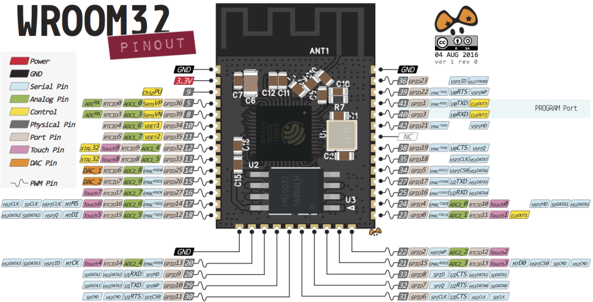
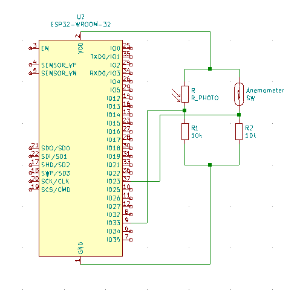

# OutdoorProbesCenter

An ESP32 module collecting measures from various sensors. The measures are then send frequently over MQTT as JSON output.
The system is currently supporting a resistor to measure an equivalent of the light intensity and the wind speed.

```json
{ "max_wind" : 0.000000, "avg_wind" : 0.000000, "light" : 0}
```

The goal is to have the device with the probe exposed outdoor.
There are also some battery life saving measure in the code (disconnecting from Wifi when unsused, disabling Bluetooth)

## Supported boards

For now, the tool was only tested on this ESP-32 board
 

## Electronic schema

It is a very simple board with only 2 10k Ohms resistors, one photoresistor and the anemometer.


The  is also available.

## Compiling

### How to compile

The best success is to use PlatformIO. Go to https://platformio.org/ and download the IDE. Just open the folder and you can compile the Firmware.
Here is a [Video](https://www.youtube.com/watch?v=clIlTEFbWLk&feature=emb_logo) tutorial in german language how to install the software. 

### Dependencies

* [PubSubClient](https://github.com/knolleary/pubsubclient/) by knolleary

## Configuration

Change your configuration in settings.h
